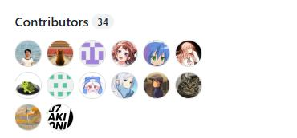

Эти люди создали Deepseek. А мы чем хуже?

## Описание проекта

Full-stack веб-приложение для управления задачами: регистрация и вход пользователей, работа со своим списком задач.

Клиентская часть — React + TypeScript + Vite, серверная — Go (`net/http`, `pgx`), хранение данных — PostgreSQL, авторизация через пользовательские сессии и HTTP cookies, пароли хэшируются с помощью bcrypt.

## Отчёты

- [Лабораторная работа 0](reports/lab0.md)
